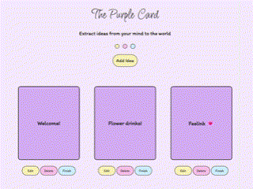
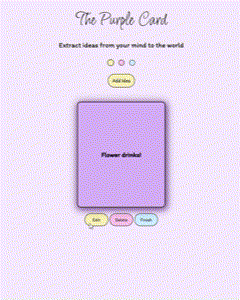

# The Frontend of The Purple Card App! <💜🎨/>

This is the frontend of my cute and creative tracking ideas app where you capture every fleeting thought on a purple card so it doesn't get lost and can come true one day!💡💜 **Please Visit [My-full-stack repository](https://github.com/aysha-alfasi/The-purple-card-full-DApp-project) to discover my lovely app more!.**

## visual overview 🍓

## Libraries & Tools ⭐  

ReactJs, sweetalert2, Howler.js (sound effects)

## visual example of the UX 🌟

##  Ready to explore the full features? 🛸

Head over to the **[full-stack DApp repository](https://github.com/aysha-alfasi/The-purple-card-full-DApp-project)** to check out the complete project. Backend, frontend, and all the magical interactions in action!💖

**I hope you enjoy the journey of bringing your ideas to life! 💜🌼**

### Thanks for visiting ♡ ⋆｡˚
